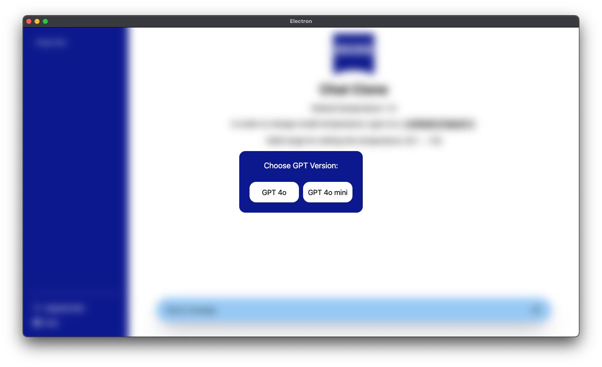

# Readme for the Electron React Frontend

```
NOTE: For this application to work an AzureOpenAI endpoint and an API key needs to be pasted at the right spot.

This can be done by exporting both as environmental variables or using the script `start_django_backend.sh`
```

This is the frontend of the Gpt4o clone. At its core it is a JavaScript, HTML, CSS application at its base, `React`(UI framework) in conjunction with the build tooling `electron-vite` wrapped around. The latter making it a platform independent application running outside of the browser.


## Steps to start App outside of Docker

### Requirements:
The following versions have been used:
- NodeJS - 22.9.0 (Slightly older versions should also work.)
- npm - 10.8.3

### Install Project dependencies:

1. Open a terminal/CMD in the folder `electron-react-frontend` and execute:

        npm install

    this should result in a new folder `node_modules` containing everything to start the application.

2. Start the application in development mode

        npm run dev

    The above window should appear letting the user chosse between `gpt-4o` and `gpt-4o-mini`.

```
NOTE: Please check beforehand if the backend is running. Otherwise, the users request will not be handled correctly.
```

### Screenshots explain more than thousand words




